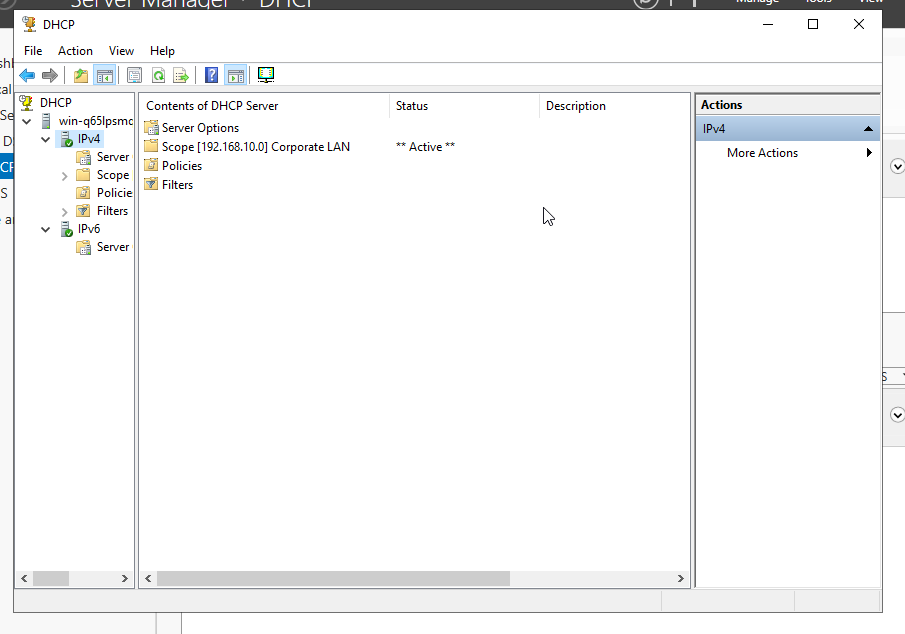
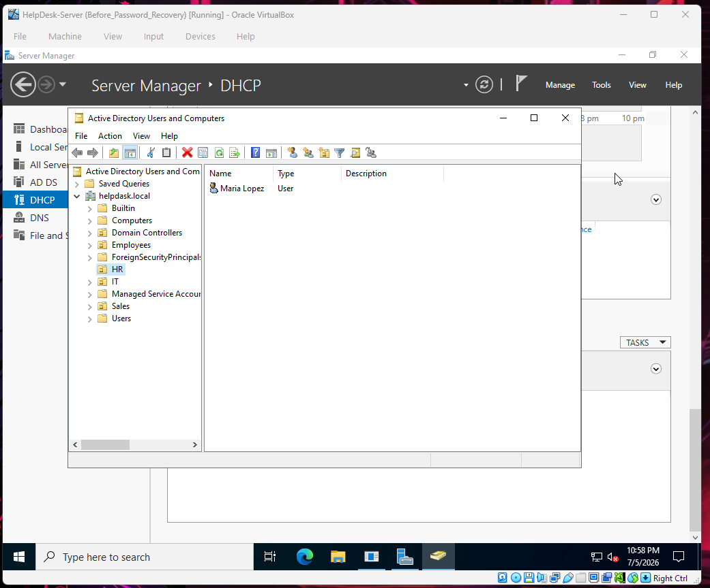
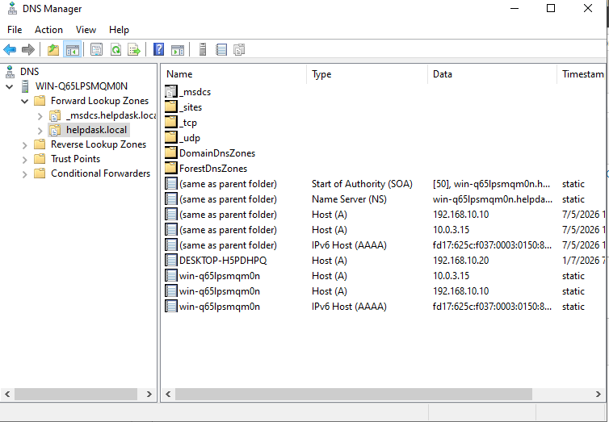
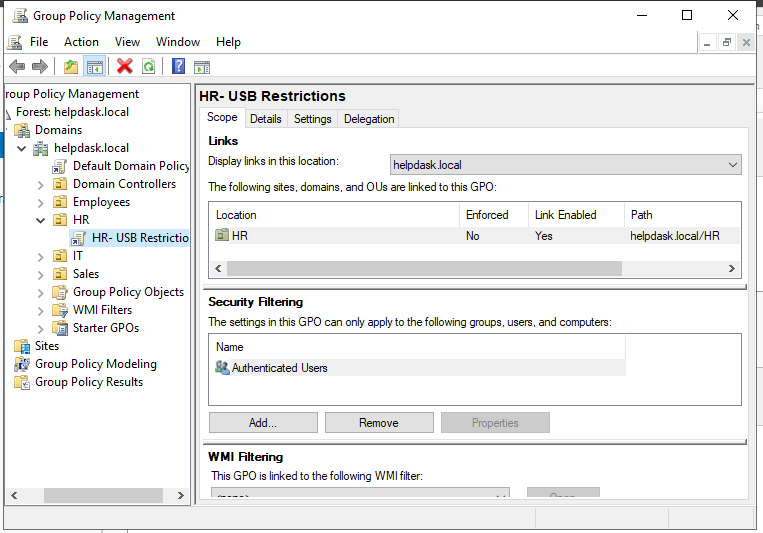
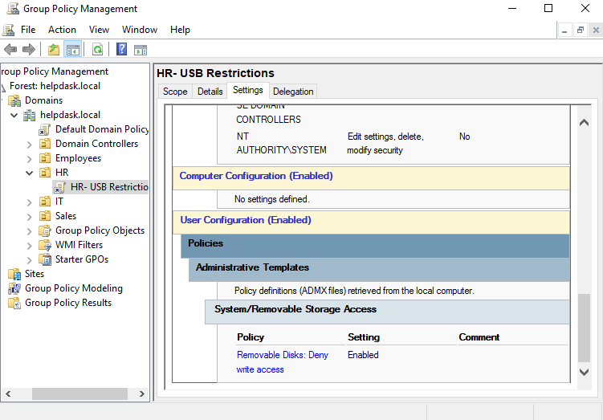
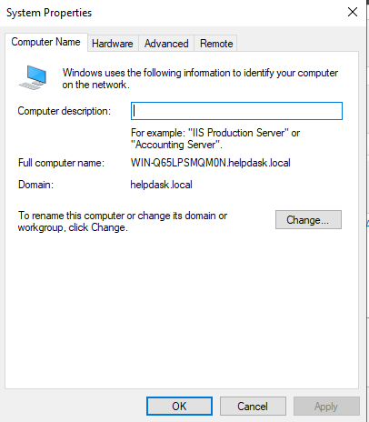

# Enterprise Active Directory Home Lab

## Overview

This project simulates a small business Active Directory environment built using Windows Server 2022 and VirtualBox.

The lab was designed to provide hands-on experience with enterprise technologies commonly used by System Administrators, Help Desk Technicians, and Network Administrators.

---

## Technologies Used

- Windows Server 2022
- Windows 10
- Active Directory Domain Services (AD DS)
- DNS
- DHCP
- Group Policy
- VirtualBox

---

## Environment

### Domain

helpdask.local

### Domain Controller

| Service | IP Address |
|----------|-----------|
| Active Directory | 192.168.10.10 |
| DNS | 192.168.10.10 |
| DHCP | 192.168.10.10 |

### DHCP Scope

192.168.10.100 - 192.168.10.200

Subnet Mask: 255.255.255.0

---

## Organizational Structure

helpdask.local
├── HR
├── IT
└── Sales

Users Created:

- Alex Brown
- Maria Lopez
- John Smith

---

## Group Policy

Created and deployed a Group Policy Object:

HR - USB Restrictions

Purpose:

Prevent HR employees from copying company data to removable USB storage devices while allowing normal access for IT and Sales departments.

---

## Skills Demonstrated

- Active Directory Administration
- DHCP Configuration
- DNS Configuration
- Group Policy Management
- Domain Authentication
- User Administration
- Password Resets
- Troubleshooting
- Windows Server Administration

---

## Troubleshooting Scenarios

### Domain Login Failure

Issue:
Users were unable to authenticate due to incorrect username formatting.

Resolution:
Verified username format and confirmed communication with the Domain Controller.

---

### User Objects Missing After Move

Issue:
Users appeared to disappear after moving between OUs.

Resolution:
Users were accidentally moved to the domain root container instead of the destination OU and were relocated appropriately.

---

### DHCP Configuration

Issue:
Client systems required automatic IP assignment.

Resolution:
Installed, authorized, and configured DHCP with an active scope.

---

## Future Improvements

- File Server
- NTFS Permissions
- Folder Redirection
- VLAN Segmentation
- Routing and NAT
- Network Monitoring
## Project Walkthrough

### DHCP Scope Configuration

Demonstrates the configured DHCP scope for client devices within the corporate LAN.

## Active Directory Organizational Structure

Created Organizational Units (OUs) for HR, IT, and Sales departments and assigned users to the appropriate departments.

This structure allows for easier administration and targeted Group Policy deployment.

## DNS Configuration

Configured an Active Directory integrated DNS zone to provide name resolution for domain services and client systems.

This allows clients to locate domain controllers and authenticate successfully.

## Group Policy Deployment

Created a Group Policy Object named `HR - USB Restrictions` and linked it to the HR Organizational Unit.

The policy prevents HR employees from copying sensitive company information to USB storage devices while allowing normal access for other departments.

### Policy Configuration

Configured the policy to deny write access to removable disks.

## Domain Membership Verification

Verified successful domain membership and Active Directory integration.

